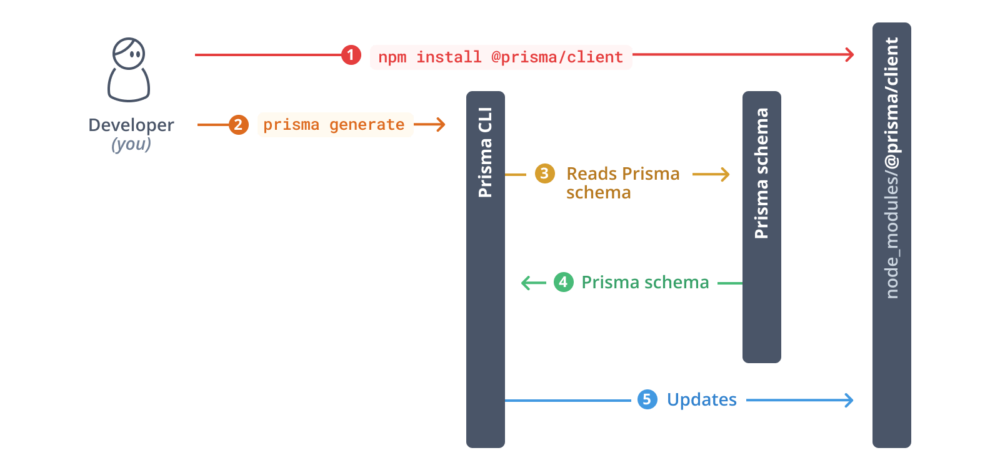

### PRisma on your Stack
1. `npm install prisma`
2. `npx prisma init`
3. `npm install @prisma/client`

3. `npx prisma db push`

### Learning
- In the string connection might be have the collection name