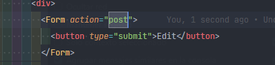

# Start pyoyext using Vite + Typescrip
- [ ] Add Redux
- [x] [Add Routing](https://reactrouter.com/en/main/start/tutorial) tutorial **instaling that say that**

## Routing
- loader: generalmente es usado para traer datos y avisar a nuestras rutas que en tal ruta se trarea algun dato, luego sera usado por un {useLoaderData} dentro de nuestro ruta especificada. *Faltaria ver si se podria usar en otras rutas*
- action: es usado para enviar datos ha cierta parte, (POST) podriamos enviar datos a nuestro backend aqui
- Por defecto el Form de react-router-rom usa el action
- Otra cosa importante es que **actions** funciona con el **<Form/>**, y depende del nombre de la accion, ese se lanzara, si no se especifica una accion en la ruta, este lo reenviara a la pagina que se especifica. Si estamos en /contact nos enviara a **/contact/{name}** siendo: <Form action="name">
